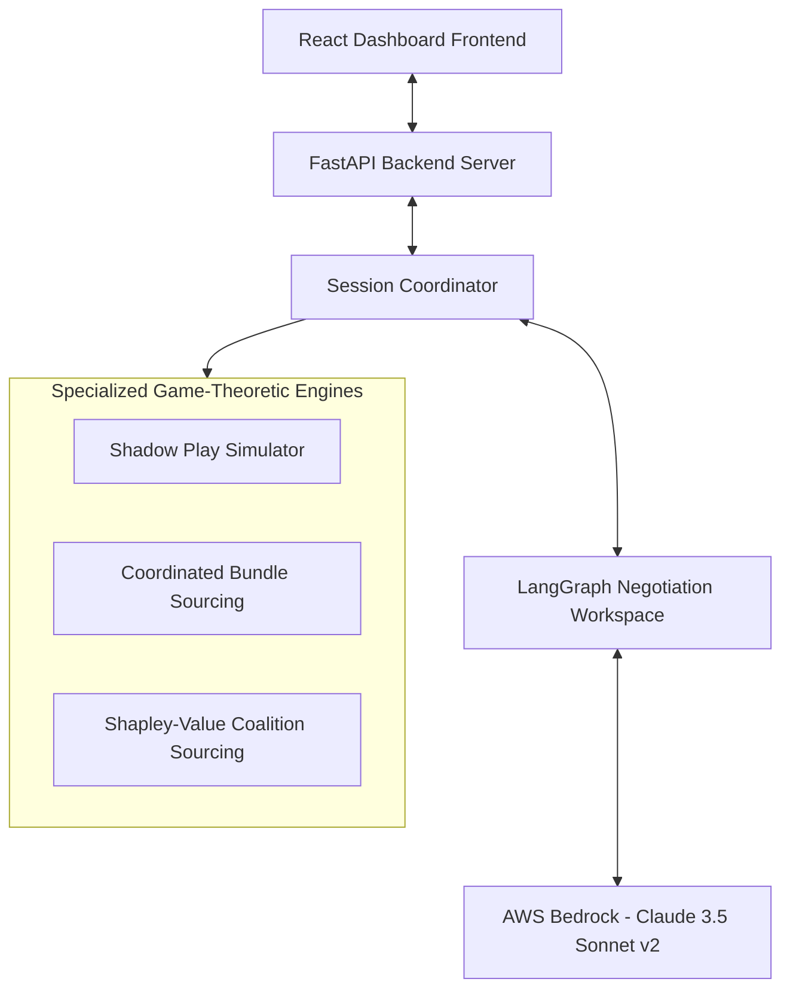

# Product Requirement Document (PRD): AgoraAgent Negotiation & Simulation Platform

## 1. Executive Summary
AgoraAgent is an AI-powered autonomous negotiation and simulation platform designed to revolutionize B2B procurement, supply chain coordination, and marketplace purchasing. By leveraging multi-agent systems (via LangGraph), advanced large language models (via AWS Bedrock), and cooperative game theory (Shapley Value allocations), AgoraAgent enables enterprises and purchasing pools to automate contract simulations, predict counterparty behavior, and optimize aggregate procurement costs.

AgoraAgent's core value proposition lies in its unique mathematical and cognitive modules, which act as a strategic advisor for procurement teams, helping them secure optimal terms with minimal human overhead.

---

## 2. Target Audience & Personas
- **Procurement Director (Enterprise):** Needs to optimize sequential vendor contracts (Design, Dev, Database) under rigid budget limits and require AI recommendations on pricing thresholds.
- **Supply Chain Lead (Cooperative Purchasing Group):** Needs a mechanism to pool volume demand across multiple buyers (coalition) to negotiate volume discounts with bulk suppliers, ensuring that the savings are distributed mathematically and transparently.
- **Marketplace Platform Operator:** Wants to embed autonomous, automated bidding and negotiation bots to facilitate peer-to-peer or buyer-to-seller transactions on their platform.
- **B2B Supplier/Vendor:** Wants to test and optimize their pricing models and sales bots against various semantic negotiation archetypes.

---

## 3. Key Feature Modules & System Architecture

### 3.1. Game-Theoretic Shadow Play Simulator
Allows users to run up to 15 parallel negotiation simulations in the background before entering a live contract.
- **Input:** Buyer maximum budget, target price, seller target price, minimum seller price, and historical counterparty behavior data.
- **Processing:** Programmatically bypasses manual checkpoints using automatic approval strategies, running negotiations to completion using Claude 3.5 Sonnet.
- **Output:** Statistical aggregates (average settled price, success rates, pricing distribution brackets) and strategic AI-generated recommendations based on counterparty cognitive memory.

### 3.2. Coordinated Bundle Sourcing Simulator
Enables sequential procurement across multiple independent service providers (e.g., Design, Development, Database) under a unified, overlapping budget pool.
- **Input:** Combined total budget, individual vendor price expectations.
- **Processing:** Sequentially conducts turn-based negotiations. Any cost savings negotiated from earlier vendor stages are dynamically injected into the maximum budget ceiling of subsequent vendors.
- **Output:** Progress step streaming, visual budget surplus trackers, and final multi-contract settlement details.

### 3.3. Shapley-Value Coalition Sourcing Simulator
Facilitates volume pooling where multiple buyers coordinate their purchasing power to secure bulk discount tiers.
- **Input:** Distinct buyer budgets and targets, volume tiers, and total volume.
- **Processing:** Runs standalone baseline simulations, establishes a unified grand coalition, conducts bulk negotiation with the supplier, and solves cooperative game theory equations (Shapley Value) to distribute savings.
- **Output:** Live EventSource stream, characteristic function savings matrix $v(S)$, and custom Shapley allocation payout cards.

### 3.4. Counterparty Semantic Archetype Classifier
Analyzes the semantics of counterparty messages turn-by-turn to predict their negotiation profile and inject matching counter-strategies.
- **Archetypes Supported:**
  - *Competitive/Aggressive:* Focuses on value claiming, uses hard boundaries or threats. Counter-strategy: Stand firm, highlight target thresholds.
  - *Collaborative/Integrative:* High trust, focuses on value creation and trade-offs. Counter-strategy: Propose multi-variable packages.
  - *Compromising/Conceding:* Seeks middle ground quickly. Counter-strategy: Expedite signature, lock in value.
  - *Avoidant/Passive:* Defers or shows low engagement. Counter-strategy: Initiate a concrete, high-anchored proposal.

---

## 4. Functional Requirements

### 4.1. User Interface & Live Dashboard
- **Requirement 4.1.1:** The user must be able to switch between "Live Negotiation Workspace", "Shadow Play Simulator", "Coordinated Bundle Sourcing", and "Coalition Sourcing" via a clean, premium tabbed interface.
- **Requirement 4.1.2:** Cognitive Relationship Memory sidebar must show real-time archetype classifications, confidence scores, and strategy hints.
- **Requirement 4.1.3:** Output metrics must be visualized dynamically (e.g. price frequency histograms, budget progression bars, Shapley allocation tables).

### 4.2. Negotiation Runtime
- **Requirement 4.2.1:** All simulations must support Server-Sent Events (SSE) to stream turn-by-turn messages and status checkpoints to the frontend asynchronously.
- **Requirement 4.2.2:** System must handle boundary crossovers (e.g. buyer target exceeds seller counter) to automatically trigger deal signatures.

### 4.3. LLM API Resilience
- **Requirement 4.3.1:** Backend must enforce a concurrency semaphore limit (e.g. max 2 active LLM call tasks) to prevent hitting AWS Bedrock rate limits (TPS quotas) during high-iteration simulations.
- **Requirement 4.3.2:** System must fall back to structured heuristics if LLM JSON outputs are malformed or fail to parse.

---

## 5. Non-Functional Requirements
- **Performance:** SSE connections must initiate within 500ms, and turn generation should average under 1.5 seconds.
- **Security:** In-transit API requests must run over TLS. Application instances must communicate with AWS Bedrock via strict IAM roles (e.g., `AgoraAgentAppRunnerInstanceRole`) using minimum privilege principles.
- **Scale:** Multi-container configuration must build dynamically using cross-platform `linux/amd64` images to run on serverless platforms like AWS App Runner.
- **Portability:** Static compiled React frontend assets must be served via the FastAPI Python backend (`morekick.server:app`) to enable single-port Docker hosting.

---

## 6. Future Roadmap
1. **Multi-Variable Negotiations:** Support negotiations on delivery timeline, SLA guarantees, and payment terms in addition to base unit price.
2. **Multi-Vendor Parallel Sourcing:** Allow the Bundle Sourcing simulator to run vendor negotiations in parallel rather than sequentially, dynamically balancing budgets using real-time bidding protocols.
3. **Database Migration:** Replace the ephemeral SQLite database with a managed PostgreSQL cluster (e.g., AWS RDS Aurora Serverless) for persistent cognitive agent memory.
